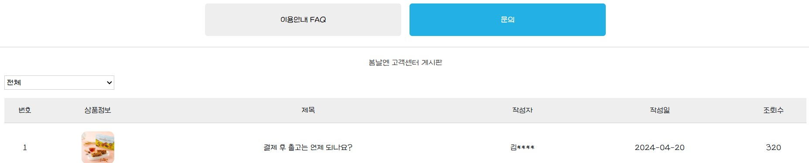
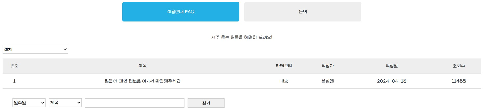

# 🍰 Dessert Shop (React Project)

> React로 제작한 디저트 쇼핑몰 프로젝트입니다.  
> styled-components를 활용한 컴포넌트 단위 디자인과 Redux 전역 상태 관리,  
> React Router를 이용한 SPA 페이지 전환을 구현했습니다.


---


## 📆 프로젝트 개요
- **개발 기간:** 2025.08  
- **참여 인원:** 개인 프로젝트  
- **목적:** React 학습을 위해 제작했고 컴포넌트 분리, 라우팅, 전역 상태 관리, 스타일링 등 핵심 개념을 직접 구현해보는 데 목적을 두었습니다.
- **배포 링크:** _(추가 예정)_  
- **GitHub Repository:** _(현재 페이지)_


---


## 🛠️ 기술 스택
| 구분 | 기술 |
|------|------|
| **Frontend** | React, Redux Toolkit, React Router |
| **Styling** | styled-components, app.css, module.css, Bootstrap (layout only) |
| **Data** | 더미 JSON 데이터 |
| **Build & Deploy** | Vite, Vercel |
<br><br>

---


## 📱 주요 기능
| 기능 | 설명 |
|------|------|
| 🧁 상품 목록 | 16개의 더미 데이터를 이용해 전체 상품 렌더링 |
| 💖 위시리스트 | 이미지 hover 시 ‘wish’ 버튼 클릭 → 팝업 메시지 출력 |
| 🛒 장바구니 | ‘add’ 버튼 클릭 시 장바구니 페이지로 이동 |
| 🏢 회사 소개 | 단순 이미지로 구성된 소개 페이지 |
| 🔗 네비게이션 | 탭 클릭 시 React Router로 페이지 전환 |
<br><br>

---


## 🗂️ 폴더 구조
```bash
src/
 ┣ components/
 ┃ ┣ ProductCard.jsx
 ┃ ┣ Header.jsx
 ┃ ┣ Footer.jsx
 ┃ ┗ Modal.jsx
 ┣ pages/
 ┃ ┣ Home.jsx
 ┃ ┣ Cart.jsx
 ┃ ┣ About.jsx
 ┃ ┗ NotFound.jsx
 ┣ redux/
 ┃ ┣ store.js
 ┃ ┗ productSlice.js
 ┣ data/
 ┃ ┗ products.js
 ┣ styles/
 ┃ ┗ GlobalStyle.js
 ┗ App.jsx
```

---

## 📌 주요 기능 상세

### 1) SPA 내부 탭 전환 (페이지 이동 없이 컴포넌트 교체)
React Router로 페이지를 나누지 않고,  
`useState`로 탭을 관리해 **한 화면에서 FAQ / 문의 게시판을 전환**하도록 구현했습니다.

<br>

---

###🖼️ UI 미리보기
<p align="center">
  
</p>
<p align="center">
  
</p>

<br>
```jsx
const [activeTab, setActiveTab] = useState("notice");

return (
  <div className={styles.tabs}>
    <button
      className={activeTab === "notice" ? styles.active : ""}
      onClick={() => setActiveTab("notice")}
    >
      이용안내 FAQ
    </button>

    <button
      className={activeTab === "freeboard" ? styles.active : ""}
      onClick={() => setActiveTab("freeboard")}
    >
      문의
    </button>
  </div>
);
```


###  2) JSON 데이터 불러오기 (동적 게시판)

```jsx
const [freeboardData, setFreeboardData] = useState([]);

useEffect(() => {
  fetch(process.env.PUBLIC_URL + "/data/freeboardData.json")
    .then(res => res.json())
    .then(data => setFreeboardData(data));
}, []);
```
→ freeboardData.json에 있는 데이터를 불러와 문의 게시판을 동적으로 구성.

###  3) 게시판 데이터 렌더링
FAQ는 정적 테이블,
문의게시판(freeboard)은 JSON 데이터를 fetch로 불러와 렌더링했습니다.

```jsx
<tbody>
  {freeboardData.map(item => (
    <tr key={item.id}>
      <td>{item.id}</td>
      <td>
        
      </td>
      <td>{item.title}</td>
      <td>{item.writer}</td>

      <td>{item.date}</td>
      <td>{item.views}</td>
    </tr>
  ))}
</tbody>

